# aspara Microbit Makecode Camera Extension 

This is the micro:bit MakeCode Extension for controlling the aspara Camera by [Growgreen Limited](https://www.grow-green.com/)

## How to add aspara Microbit MakeCode Camera Extension to your MakeCode project

* Create/Open a MakeCode project using the micro:bit MakeCode Editor at https://makecode.microbit.org
* In the web editor, click on <B>"Extensions"</B> to add extensions to the project

    

* Enter "<I><B>https://github.com/growgreenhk/aspara-microbit-makecode-camera-extension</B></I>" and search

    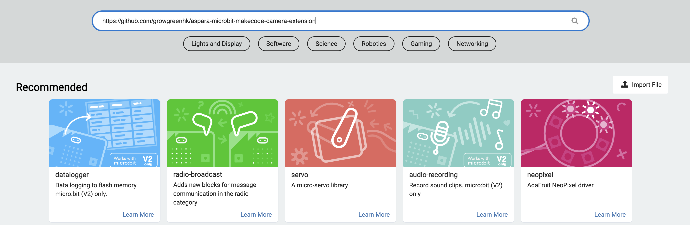

* Select the <B>"aspara-microbit-makecode-camera-extension"</B> from the search results.

    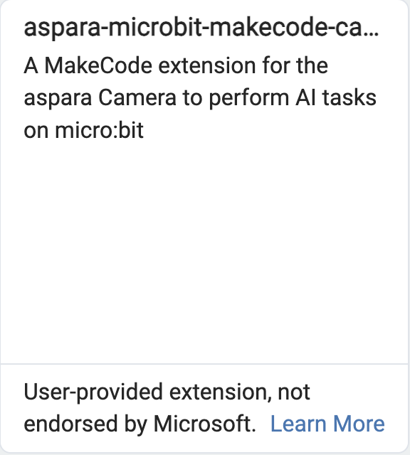

* <B>"aspara Camera"</B> will show up in the editor and be ready to use.

    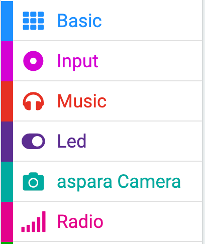

## How to use the extension
### On start - assign the serial communication port's [tx] and [rx] pins
* E.g. P0 to "tx pin" and P1 to "rx pin"

    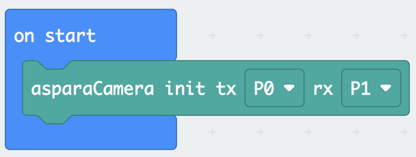

### Set the aspara Camera to a feature mode.
* E.g. Set to "Line Tracking" mode

    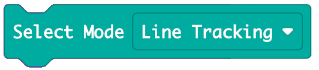

### Exit the feature mode
* Select "none" mode

    

### Get results
* Use the following block to get the feature result

    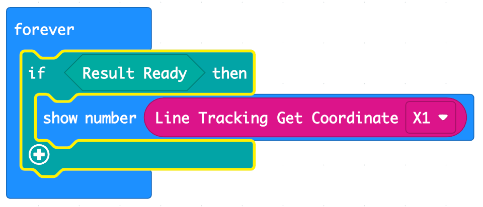

* Wait for result ready, then get the result string or number

## [Mode] Line Tracking
* Follow the line with specified color and return the line coordinates
* You could use the <B><I>"Line Tracking Select Color"</I></B> block or <B><I>"Line Tracking Set Color"</I></B> block to select your target color

    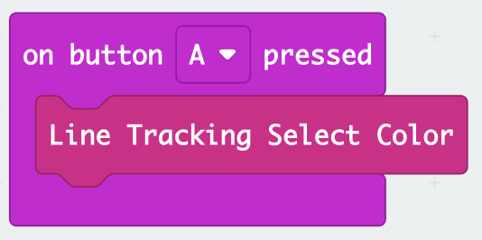 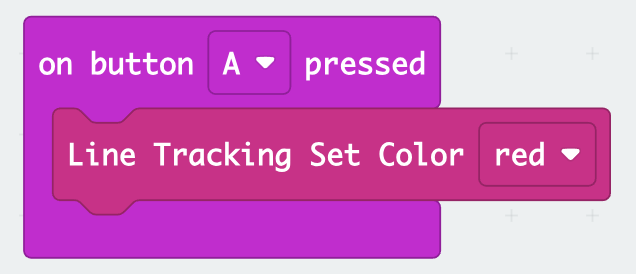

* Demo: https://makecode.microbit.org/S82535-81900-19008-26073

## [Mode] Color Tracking
* Follow the object with specified color and return the coordinates
* You could use the <B><I>"Color Tracking Select Color"</I></B> block or <B><I>"Color Tracking Set Color"</I></B> block to select your target color

    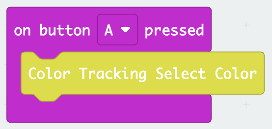 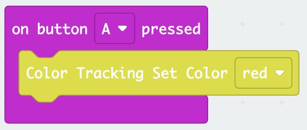

* Demo: https://makecode.microbit.org/S24837-51094-76361-54804

## [Mode] Object Detection
* General Oject detection and return the number of detected objects.

* Demo: https://makecode.microbit.org/S58563-16833-87646-54598

## [Mode] Plant Diagnosis
* Detect the plant health and return the name of the planting problem

* Demo: https://makecode.microbit.org/S54546-52129-52097-99486

## [Mode] Green/Red Lettuce Classification
* To detect the plant is Green lettuce or Red lettuce, and it returns "Green" or "Red"

* Demo: https://makecode.microbit.org/S57813-64135-25137-48434

## [Mode] Object Classifcation
* General Object Classification and return the name of the detected object.

* Demo: https://makecode.microbit.org/S42923-67730-61115-17309

## [Mode] Image Classification
* To detect the user labelled ojects on the display and return the label of the result.

* You could use the <B><I>"Capture Image with Label"</I></B> block to add an image on the display with the input label.

    E.g.

    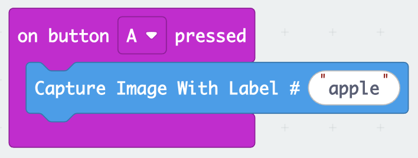
    
    would add the image on the display with label "apple" when button "A" is pressed.

* You could use the <B><I>"Image Classfication Clear All Labels"</I></B> block to clear all labels.

    E.g.

    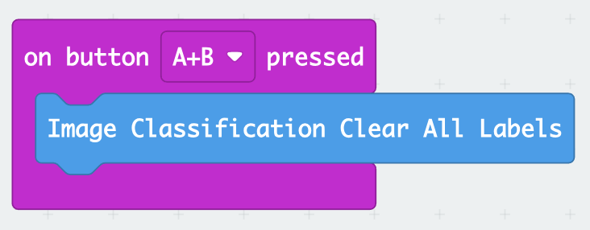
    
    would clear all labels when button "A+B" is pressed.

* Demo: https://makecode.microbit.org/S45171-11395-85226-25804

## [Mode] Face Detection
* Detect how many faces on the display and return the number of faces.

* Demo: https://makecode.microbit.org/S41911-72788-99219-78181

## [Mode] Facial Expression Detection
* Detect the facial expression on the display

* Demo: https://makecode.microbit.org/S47076-23103-19746-57899

## [Mode] Custom Model Image classification
* Detect the custom objects in the user model

* Demo: https://makecode.microbit.org/S25031-48926-03975-79534
    * To make your own models, use any of the methods below:
        1. [Using aspara Camera To Create Custom Image Classification Model By Teachable Machine](./docs/Using_aspara_Camera_To_Create_Custom_Image_Classification_Model_By_Teachable_Machine.md) 
        2. [Using aspara Camera To Create Custom Image Classification Model By Google Colab](./docs/Using_aspara_Camera_To_Create_Custom_Image_Classification_Model_By_Google_Colab.md)
    

## [Mode] Scan Number
* Detect the numer 0 - 9 on the display

* Demo: https://makecode.microbit.org/S86583-57556-42878-36776

## [Mode] Scan Alphabet
* Detect the numer A - Z, 0 - 9 on the display

* Demo: https://makecode.microbit.org/S08673-11210-13515-81797

## [Mode] Scan QR/Bar Code
* Detect any QR/Bar code on the display, then return the detected content

* Demo: https://makecode.microbit.org/S70205-94493-05894-36101

## Set WiFi Credentials
* Set the WiFi SSID and password

* Demo: https://makecode.microbit.org/S13281-72802-37846-52575

## Set Camera and Device Display Orientation Angles
* By setting the Camera and the Device LCD display Orientation Angles (0°, 90°, 180° or 270°), you could capture and display correctly with different device orientations.
* Demo: https://makecode.microbit.org/S11434-96710-16483-90767

## Take User Photo Demo
* Take a user photo and save to device

* Demo: https://makecode.microbit.org/S91673-02246-61208-06965

## Take Plant Photo Demo
* Take a planting photo on aspara Smart Grower

* Demo: https://makecode.microbit.org/S23513-65452-25410-30947
