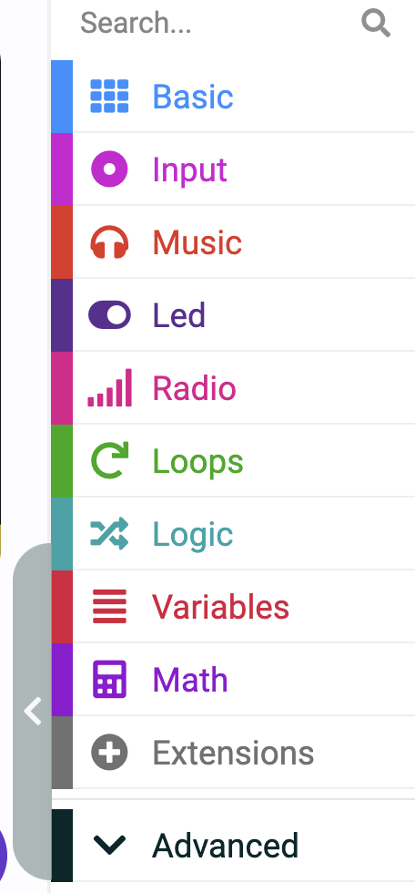

# aspara Microbit Makecode Camera Extension 

This is the micro:bit MakeCode Extension for controlling the asparaCamera by [Growgreen Limited](https://www.grow-green.com/)

## How to add aspara Microbit MakeCode Camera Extension to your MakeCode project

* Create/Open a MakeCode project using the micro:bit MakeCode Editor at https://makecode.microbit.org
* In the web editor, click on <B>"Extensions"</B> to add extensions to the project

    

* Enter "<I><B>https://github.com/growgreenhk/aspara-microbit-makecode-camera-extension</B></I>" and search

    

* Select the <B>"aspara-smart-grower"</B> from the search results.

    

# aspara Camera Line Tracking Demo
https://makecode.microbit.org/S82535-81900-19008-26073

## Usage
1. Add the extension to your MakeCode project by searching for `aspara-microbit-makecode-camera-extension` or using the GitHub URL: `github.com/...`.