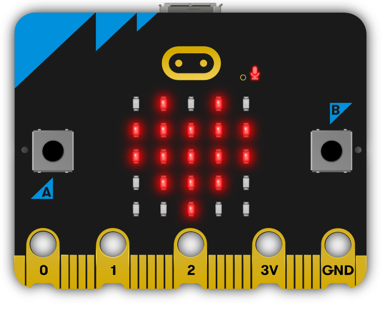
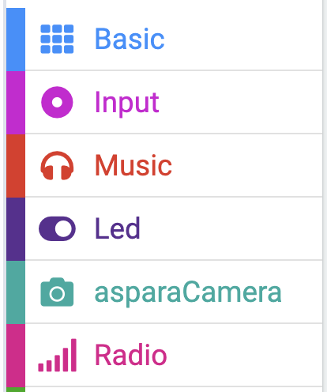
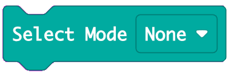

# aspara Microbit Makecode Camera Extension 

This is the micro:bit MakeCode Extension for controlling the asparaCamera by [Growgreen Limited](https://www.grow-green.com/)

## How to add aspara Microbit MakeCode Camera Extension to your MakeCode project

* Create/Open a MakeCode project using the micro:bit MakeCode Editor at https://makecode.microbit.org
* In the web editor, click on <B>"Extensions"</B> to add extensions to the project

    

* Enter "<I><B>https://github.com/growgreenhk/aspara-microbit-makecode-camera-extension</B></I>" and search

    

* Select the <B>"aspara-microbit-makecode-camera-extension"</B> from the search results.

    

* <B>"asparaCamera"</B> will show up in the editor and be ready to use.

    

## How to use the extension
### On start - assign the UART Comm port "tx pin" and "rx pin"
* E.g. P0 to "tx pin" and P1 to "rx pin"

    

### Assign the asparaCamera to a feature mode.
* E.g. to the "Line Tracking" mode

    

### Quit a feature mode
* Select "none" mode

    

### Get results
* Use the following block to get the feature result

    

* Wait for result ready, then get the result string or number

## Line Tracking
* Follow the line with specified color and return the line coordinates
* You could use the $\textcolor{Cyan}{\text{"Line Tracking Select Color"}}$ block or $\textcolor{Cyan}{\text{"Line Tracking Set Color"}}$ block to select your target color

     

* Demo: https://makecode.microbit.org/S82535-81900-19008-26073

## Color Tracking
* Follow the object with specified color and return the coordinates
* You could use the $\textcolor{Cyan}{\text{"Color Tracking Select Color"}}$ block or $\textcolor{Cyan}{\text{"Color Tracking Set Color"}}$ block to select your target color

     

* Demo: https://makecode.microbit.org/S24837-51094-76361-54804

## Object Detection
* General Oject detection and return the number of detected objects.

* Demo: https://makecode.microbit.org/S58563-16833-87646-54598

## Plant Diagnosis
* Detect the plant health and return the name of the planting problem

* Demo: https://makecode.microbit.org/S54546-52129-52097-99486

## Green/Red Lettuce Classification
* To detect the plant is Green lettuce or Red lettuce, and it returns "Green" or "Red"

* Demo: https://makecode.microbit.org/S57813-64135-25137-48434

## Object Classifcation
* General Object Classification and return the name of the detected object.

* Demo: https://makecode.microbit.org/S42923-67730-61115-17309

## Image Classification
* To detect the user labelled ojects on the display and return the label of the result.

* You could use the $\textcolor{Cyan}{\text{"Capture Image With Label \#"}}$ block to add an image on the display with the input label.

    E.g.

    
    
    would add the image on the display with label "apple" when button "A" is pressed.

* You could use the $\textcolor{Cyan}{\text{"Image Classfication Clear All Labels"}}$ block to clear all labels.

    E.g.

    
    
    would clear all labels when button "A+B" is pressed.

* Demo: https://makecode.microbit.org/S25508-73540-80879-54682

## Face Detection
* Detect how many faces on the display and return the number of faces.

* Demo: https://makecode.microbit.org/S73568-28523-21337-20324

## Facial Expression Detection
* Detect the facial expression on the display

* Demo: https://makecode.microbit.org/S47076-23103-19746-57899

## Scan Number
* Detect the numer 0 - 9 on the display

* Demo: https://makecode.microbit.org/S05224-48559-62435-22184

## Scan Alphabet
* Detect the numer A - Z, 0 - 9 on the display

* Demo: https://makecode.microbit.org/S08673-11210-13515-81797

## Scan QR/BarCode
* Detect any QR/Bar code on the display, then return the detected content

* Demo: https://makecode.microbit.org/S45956-38912-02893-96753

## Set WiFi Credentials
* Set the WiFi SSID and password

* Demo: https://makecode.microbit.org/S11553-56566-32334-15099
